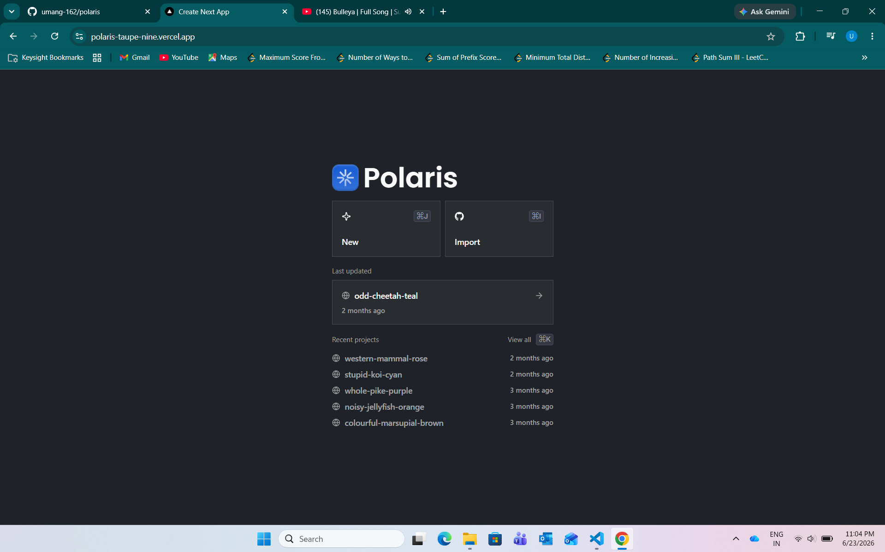
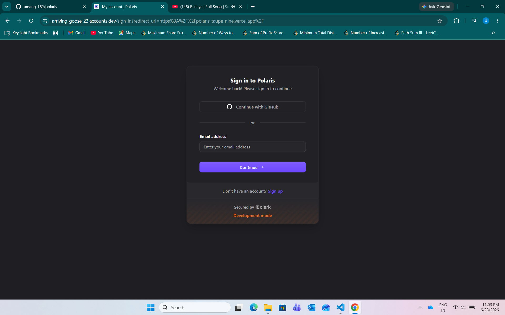
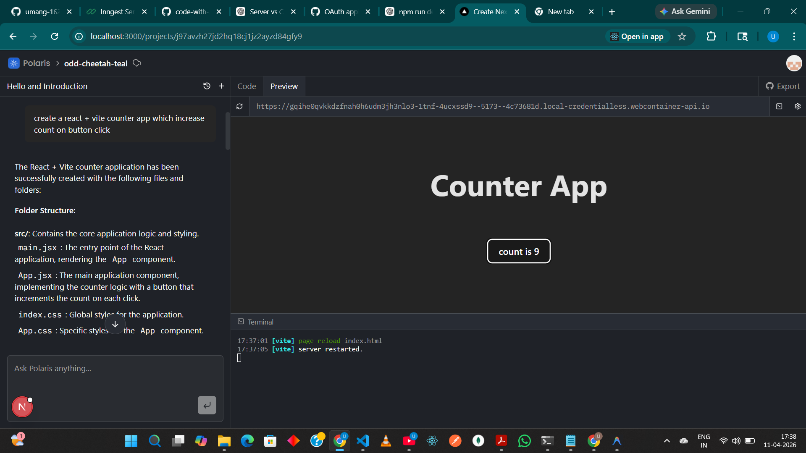
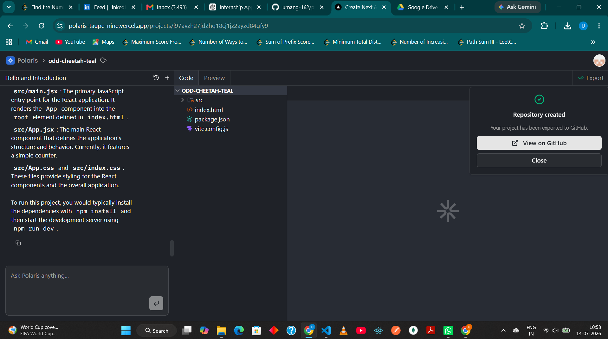
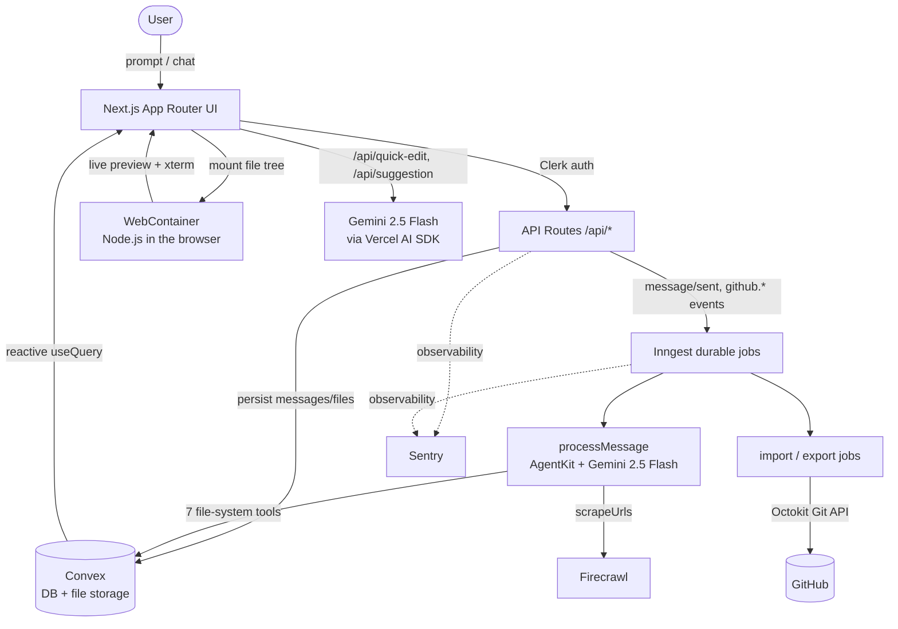

# Polaris

**Prompt to app, entirely in your browser.**

Polaris is an AI-powered, in-browser app builder: describe what you want in plain English and an autonomous coding agent plans, writes, and organizes a full project's files for you, then runs it live in a browser-based dev environment and ships it straight to GitHub — no local toolchain required. Think of it as a "prompt → running app" platform in the spirit of v0, Bolt, and Lovable, built on Next.js, Convex, and WebContainers.

**[▶ Live Demo](https://polaris-taupe-nine.vercel.app)**

> The live demo is gated behind sign-in (Clerk). To evaluate without creating an account, watch the demo GIF below — it shows the full prompt → generate → live-preview loop end to end.

<!-- TODO: replace with a real recording. Capture a 10–15s GIF of: typing a prompt → the agent creating files → the WebContainer preview rendering the running app. Save to docs/demo.gif and uncomment. -->
<!-- <p align="center"></p> -->

<p align="left">
  
  
  
  
  
  
</p>

---

## Table of Contents

- [Overview](#overview)
- [Why Polaris](#why-polaris)
- [Screenshots](#screenshots)
- [Key Features](#key-features)
- [Tech Stack](#tech-stack)
- [Architecture / How It Works](#architecture--how-it-works)
- [Engineering Challenges](#engineering-challenges)
- [Project Structure](#project-structure)
- [Getting Started](#getting-started)
- [Environment Variables](#environment-variables)
- [Available Scripts](#available-scripts)
- [Deployment](#deployment)
- [Roadmap](#roadmap)
- [Acknowledgements](#acknowledgements)

---

## Overview

Polaris turns a natural-language prompt into a working, editable, deployable application — entirely in the browser.

A user signs in, types a prompt, and Polaris spins up a project backed by a realtime database. An autonomous AI agent ("Polaris") receives the message, inspects the project's virtual file tree, and then reads, creates, updates, and organizes files using a set of purpose-built tools — completing the entire task in a single durable background run rather than stopping for confirmation at each step. Every file and message is persisted to Convex, so the UI updates reactively as the agent works.

The generated project is then mounted into a **WebContainer** — a full Node.js runtime running inside the browser tab — where Polaris installs dependencies, starts the dev server, and surfaces a live preview alongside a CodeMirror editor with AI-assisted quick-edit and inline autocompletion. When the user is happy, the project can be exported to a brand-new GitHub repository (or an existing repo can be imported into Polaris to begin with).

[↑ Back to top](#polaris)

---

## Why Polaris

Most "prompt → app" tools generate code in a single request and hand you a snippet. Polaris is built around three things that are harder to get right — and that make it closer to a real development environment than a code-snippet generator:

- **It actually runs the app, in the browser.** Generated projects are mounted into a WebContainer (a full Node.js runtime in the tab), so `npm install` and the dev server run client-side with a live preview — no local toolchain, no container backend to provision.
- **Generation is durable and cancelable, not a fragile request.** The agent can take 20+ tool calls and several minutes; it runs as a durable Inngest background job with cancellation and failure recovery, so a closed tab or a timeout doesn't lose the work.
- **It closes the loop back to GitHub.** Projects can be imported from and exported to real GitHub repositories (blobs → tree → commit → ref) via the GitHub Git API, so the output is a real repo, not a throwaway sandbox.

[↑ Back to top](#polaris)

---

## Screenshots

### 🏠 Landing Page & 🔐 Sign Up

<p align="center">
  
  
</p>

---

### 💻 AI Code Editor + Live Preview

<p align="center">
  
</p>

---

### 🚀 GitHub Export

<p align="center">
  
</p>


[↑ Back to top](#polaris)

---

## Key Features

**🤖 Autonomous AI coding agent**
- A Google Gemini–powered agent ("Polaris") that plans and executes a complete file-generation task in one run — creating folders, batch-creating files, reading existing code, updating, renaming, and deleting — without stopping for confirmation.
- Eight first-class agent tools: `listFiles`, `readFiles`, `createFiles` (batch), `updateFile`, `deleteFiles` (recursive), `createFolder`, `renameFile`, and `scrapeUrls`. The tool schemas (Zod-validated), the system prompt that drives planning, and the batch-create / recursive-delete semantics are custom; AgentKit provides only the network and retry plumbing.
- `scrapeUrls` pulls external documentation into markdown (via Firecrawl) so the agent can reference real APIs and docs while building.
- Auto-generates a concise 3–6 word conversation title from the first message.

**⚡ Durable, cancelable background execution**
- The agent runs as an Inngest durable function (`process-message`), triggered by a `message/sent` event and cancelable mid-flight via `message/cancel`.
- Bounded to a maximum of 20 network iterations, with an `onFailure` handler that surfaces failures back into the chat.

**🖥️ In-browser dev environment**
- Live preview powered by a **WebContainer** (by StackBlitz, via `@webcontainer/api`) — a real Node.js runtime in the browser — that mounts the project's files, runs the install + dev commands (configurable per project), and surfaces the running app via the `server-ready` event.
- A read-only `xterm.js` terminal streams install/dev process output; hot reload writes file changes straight into the running container.

**✍️ AI-assisted code editor**
- CodeMirror 6 editor with per-language syntax highlighting, a one-dark theme, a minimap, and indentation guides.
- **Quick edit** (`Mod-K` on a selection): describe a change in a tooltip and the selection is rewritten by Gemini.
- **Inline suggestions**: debounced (300 ms) ghost-text autocompletion accepted with `Tab`.

**🔄 GitHub import & export**
- Import an existing repository (tree + blobs, with binary-file detection) into a Polaris project — trying the `main` branch first, then falling back to `master`.
- Export a generated project to a brand-new GitHub repository — building blobs, a tree, a commit, and updating the branch ref via the GitHub Git API. Both run as durable Inngest jobs and are Pro-plan gated (via Clerk).

**🔐 Auth & realtime data**
- Clerk authentication wired into Convex via native JWT integration; every user-facing query and mutation enforces project ownership.
- Convex provides the realtime database and file storage; binary files are stored as Convex storage objects with generated URLs.

**📊 Observability**
- Sentry across server, edge, and client runtimes (tracing, logging, and session replay), with a `/monitoring` tunnel route and Inngest–Sentry middleware.

[↑ Back to top](#polaris)

---

## Tech Stack

| Layer | Technology | Role & Rationale |
|---|---|---|
| **Framework** | [Next.js 16](https://nextjs.org) (App Router) | Full-stack React framework; hosts the UI, API routes, and the Inngest serve endpoint. Custom security headers (`COEP`/`COOP`) are required to enable `SharedArrayBuffer` for WebContainers. |
| **Language** | [TypeScript 5](https://www.typescriptlang.org) | End-to-end type safety in `strict` mode, with path aliases (`@/*`) and Convex's generated types shared across client and server. |
| **UI runtime** | [React 19](https://react.dev) | Component model for the editor, preview, and project workspace. |
| **Styling** | [Tailwind CSS v4](https://tailwindcss.com) + [shadcn/ui](https://ui.shadcn.com) (new-york) | Utility-first styling configured purely via the PostCSS plugin (no JS config in v4); shadcn/ui + Radix/Base UI primitives and `lucide-react` icons for an accessible, consistent component layer. |
| **Backend / DB** | [Convex](https://convex.dev) | Realtime database, file storage, and typed server functions. Reactive `useQuery`/`useMutation` with optimistic updates power the UI; an internal-key-gated `system.*` namespace lets trusted server jobs bypass per-user auth. |
| **Auth** | [Clerk](https://clerk.com) | Authentication + Pro-plan gating; also the source of GitHub OAuth tokens for import/export. Integrated with Convex via native Clerk JWT verification. |
| **Background jobs** | [Inngest](https://www.inngest.com) + [AgentKit](https://agentkit.inngest.com) | Durable, cancelable orchestration for the AI agent and the GitHub import/export pipelines. AgentKit builds the agent network and registers the file-system tools. |
| **AI** | [Vercel AI SDK](https://sdk.vercel.ai) + [`@ai-sdk/google`](https://sdk.vercel.ai/providers/ai-sdk-providers/google-generative-ai) (Gemini 2.5 Flash) | LLM calls for the coding agent, title generation, quick-edit, and inline suggestions. `tokenlens` is included as a dependency for LLM token accounting (not yet wired into the reviewed code paths). |
| **In-browser runtime** | [WebContainers](https://webcontainers.io) (`@webcontainer/api`) + [`xterm.js`](https://xtermjs.org) | Runs the generated project (install + dev server) and streams terminal output entirely client-side. |
| **Code editor** | [CodeMirror 6](https://codemirror.net) | The editor surface, with language extensions, theming, minimap, indentation markers, and custom AI quick-edit/suggestion extensions. |
| **Streaming UI** | [`streamdown`](https://www.npmjs.com/package/streamdown) + [Shiki](https://shiki.style) | Streaming-markdown rendering with syntax-highlighted code blocks for the agent's chat output. |
| **Web scraping** | [Firecrawl](https://www.firecrawl.dev) (`@mendable/firecrawl-js`) | Converts external URLs to markdown so the agent can ground its work in real documentation. |
| **GitHub API** | [Octokit](https://github.com/octokit/octokit.js) | Reads repo trees/blobs on import and creates blobs/trees/commits/refs on export. |
| **State & forms** | [Zustand](https://zustand-demo.pmnd.rs), [React Hook Form](https://react-hook-form.com) / [TanStack Form](https://tanstack.com/form), [Zod](https://zod.dev) | Client editor/tab state, form state, and runtime schema validation for tools, requests, and AI structured outputs. |
| **Monitoring** | [Sentry](https://sentry.io) | Error/performance monitoring and session replay across all runtimes. |
| **Hosting** | [Vercel](https://vercel.com) | Deployment target for the Next.js app. |

[↑ Back to top](#polaris)

---

## Architecture / How It Works

Polaris is a Next.js app whose API routes authenticate requests (Clerk), persist state (Convex), and offload all long-running work to durable Inngest functions. The AI agent never runs inline in a request — it runs as a background job and writes its results back to Convex, which the UI observes reactively.

### The prompt → app loop

```text
1. Prompt        User describes an app (or sends a chat message)
2. Persist       API route creates user + "processing" assistant messages in Convex,
                 then fires an Inngest "message/sent" event
3. Agent         Inngest `processMessage` runs the Gemini agent (AgentKit network):
                   listFiles → readFiles → createFolder/createFiles → updateFile …
                   (optionally scrapeUrls for docs) — up to 20 iterations
4. Write-back    Agent calls Convex `system.*` mutations (internal-key gated) to
                 create/update files and the assistant's final summary message
5. Preview       Browser mounts the Convex file tree into a WebContainer,
                 runs install + dev, and shows the live app + xterm output
6. Edit          CodeMirror editor with AI quick-edit (Mod-K) and inline suggestions;
                 changes hot-reload into the running container
7. Export        One durable Inngest job creates a GitHub repo and pushes the project
```

### Component diagram



### Notable design points

- **Agent isolation via durable jobs.** Because generation can take many tool calls, it runs as an Inngest function with cancellation support, retry semantics, and an `onFailure` hook — not in a fragile request/response cycle.
- **Two-tier Convex access.** User-facing functions enforce `ownerId` ownership on every call; a separate `system.*` namespace, gated by a shared internal key, lets server jobs and the agent read/write without per-user auth.
- **COEP/COOP headers.** `next.config.ts` sets `Cross-Origin-Embedder-Policy: credentialless` and `Cross-Origin-Opener-Policy: same-origin` on all routes — a hard requirement for the `SharedArrayBuffer` that WebContainers depend on.
- **Reactive-by-default UI.** The editor and file tree are driven by Convex's reactive queries with optimistic updates, so the agent's background writes appear in the UI without manual polling.

[↑ Back to top](#polaris)

---

## Engineering Challenges

The interesting problems in Polaris weren't the feature checklist — they were the constraints that come with running an AI agent and a live runtime in a browser tab:

- **Long-running generation that survives a closed tab.** A full app generation can take 20+ tool calls and minutes of wall-clock time — far past any HTTP request timeout. Generation runs as a durable Inngest job triggered by a `message/sent` event, with a `message/cancel` cancellation path and an `onFailure` hook that writes the error back into the conversation, so the chat UI never silently stalls.
- **Cross-origin isolation for WebContainers.** WebContainers require `SharedArrayBuffer`, which the browser only exposes under cross-origin isolation. Every route therefore ships `Cross-Origin-Embedder-Policy: credentialless` and `Cross-Origin-Opener-Policy: same-origin` headers — a small config detail that the entire in-browser runtime depends on.
- **Letting a trusted backend write data without impersonating a user.** User-facing Convex functions enforce per-user ownership, but the background agent has no user session. A second `system.*` Convex namespace, gated by a shared internal key (`POLARIS_CONVEX_INTERNAL_KEY`), lets the agent and Inngest jobs read and write project data safely without weakening per-user auth on the public API.
- **A single WebContainer, booted once.** WebContainers permit only one instance per page, so the boot is a promise-based singleton with teardown/reboot keyed by a `restartKey` to recover cleanly between projects.

[↑ Back to top](#polaris)

---

## Project Structure

```text
polaris/
├── convex/                         # Convex backend: schema, queries, mutations
│   ├── schema.ts                   #   projects, files, conversations, messages
│   ├── auth.ts / auth.config.ts    #   Clerk JWT integration + verifyAuth helper
│   ├── projects.ts / files.ts      #   user-facing CRUD (ownership-enforced)
│   ├── conversations.ts            #   chat threads + messages
│   └── system.ts                   #   internal-key-gated API for server jobs
├── src/
│   ├── app/                        # Next.js App Router
│   │   ├── layout.tsx / page.tsx   #   root layout + landing (ProjectsView)
│   │   └── api/                    #   messages, quick-edit, suggestion,
│   │                               #   projects, github/*, inngest
│   ├── components/                 # Shared UI + providers (Clerk/Convex/theme)
│   │   └── ui/                     #   shadcn/ui components
│   ├── features/                   # Feature modules (the bulk of the app)
│   │   ├── conversations/          #   AI agent: process-message + tools + prompts
│   │   ├── projects/               #   project hooks, workspace view, GitHub jobs
│   │   ├── editor/                 #   CodeMirror editor + AI extensions
│   │   └── auth/                   #   auth-state views
│   ├── inngest/                    # Inngest client + demo functions
│   ├── lib/                        # Convex clients, Firecrawl client, cn() util
│   ├── instrumentation*.ts         # Sentry server/edge/client init
│   └── proxy.ts                    # Clerk middleware (route protection)
├── next.config.ts                  # COEP/COOP headers + Sentry wrapper
├── components.json                 # shadcn/ui config (new-york, neutral)
└── package.json
```

> Paths above reflect the modules described in the codebase; exact filenames within each feature folder may vary.

[↑ Back to top](#polaris)

---

## Getting Started

### Prerequisites

- **Node.js 20+** (implied by `@types/node@^20`)
- **npm** (or your preferred package manager)
- A **Convex** account (`npx convex` provisions a dev deployment)
- A **Clerk** application (publishable + secret keys, and a JWT template named `convex`)
- A **Google Generative AI (Gemini)** API key
- A **Firecrawl** API key
- For GitHub import/export: a Clerk **GitHub OAuth** connection
- An **Inngest** account (or the local Inngest dev server) for background jobs

### 1. Clone and install

```bash
git clone https://github.com/umang-162/polaris.git
cd polaris
npm install
```

### 2. Configure environment

Copy the example file and fill in your values (see the [Environment Variables](#environment-variables) table):

```bash
cp .env.example .env.local
```

### 3. Start Convex

Convex generates types and runs your dev deployment. On first run it will prompt you to log in and create a project, and will print your `NEXT_PUBLIC_CONVEX_URL`:

```bash
npx convex dev
```

Set the Convex-side variables (`CLERK_JWT_ISSUER_DOMAIN` and `POLARIS_CONVEX_INTERNAL_KEY`) on your Convex deployment — via the Convex dashboard or `npx convex env set NAME value` — since these are read inside Convex functions.

### 4. Start the Inngest dev server (background jobs)

In a separate terminal, run the local Inngest dev server pointed at the app's serve endpoint so the agent and GitHub jobs execute locally:

```bash
npx inngest-cli@latest dev -u http://localhost:3000/api/inngest
```

### 5. Run the app

```bash
npm run dev
```

Open **http://localhost:3000**.

[↑ Back to top](#polaris)

---

## Environment Variables

Compiled from every environment variable referenced across the codebase. Public (`NEXT_PUBLIC_*`) variables are exposed to the browser; the rest are server- or Convex-side only. A `.env.example` with placeholder values is committed at the repo root.

| Variable | Description | Required |
|---|---|---|
| `NEXT_PUBLIC_CONVEX_URL` | Convex deployment URL used by the browser/server Convex clients. Printed by `npx convex dev`. | **Yes** |
| `CLERK_JWT_ISSUER_DOMAIN` | Clerk JWT issuer domain used by Convex (`convex/auth.config.ts`) to validate Clerk-issued tokens (paired with application ID `convex`). Set on the **Convex** deployment. | **Yes** |
| `POLARIS_CONVEX_INTERNAL_KEY` | Shared internal secret that gates the Convex `system.*` namespace, allowing trusted server jobs/agent to bypass per-user auth. Used by API routes, Inngest jobs, and validated inside Convex. | **Yes** |
| `FIRECRAWL_API_KEY` | Firecrawl API key for URL → markdown scraping (`src/lib/firecrawl.ts`). | **Yes** (for `scrapeUrls` / quick-edit doc context) |
| `NEXT_PUBLIC_CLERK_PUBLISHABLE_KEY` | Clerk publishable key for the client SDK (read by the Clerk SDK by convention). | **Yes** |
| `CLERK_SECRET_KEY` | Clerk secret key for server-side auth and GitHub OAuth-token retrieval (read by the Clerk SDK by convention). | **Yes** |
| `GOOGLE_GENERATIVE_AI_API_KEY` | Google Gemini API key, read by `@ai-sdk/google` by convention for all LLM calls. | **Yes** (for all AI features) |
| `CI` | Set in CI environments; toggles Sentry's `silent` build option in `next.config.ts` (`silent: !process.env.CI`). | No (set by CI) |
| `NEXT_RUNTIME` | Next.js-managed discriminator (`nodejs` / `edge`) used in `instrumentation.ts` to pick the right Sentry config. | No (set by Next.js) |

> **Notes:**
> - `NEXT_PUBLIC_CLERK_PUBLISHABLE_KEY`, `CLERK_SECRET_KEY`, and `GOOGLE_GENERATIVE_AI_API_KEY` are read by their respective SDKs by convention rather than referenced directly via `process.env` in source; the names above are the conventional ones used by Clerk and `@ai-sdk/google`.
> - **Never commit real secrets.** Keep them in `.env.local` (gitignored); only `.env.example` (placeholders) is committed.

[↑ Back to top](#polaris)

---

## Available Scripts

From `package.json`:

| Script | Command | Description |
|---|---|---|
| `npm run dev` | `next dev` | Start the Next.js development server. |
| `npm run build` | `next build` | Create a production build. |
| `npm run start` | `next start` | Serve the production build. |
| `npm run lint` | `eslint` | Lint with the flat ESLint config (Next.js core-web-vitals + TypeScript). |

> Convex (`npx convex dev`) and the Inngest dev server (`npx inngest-cli@latest dev`) are run alongside these during local development.

[↑ Back to top](#polaris)

---

## Deployment

Polaris is built to deploy on **Vercel** (Next.js) with **Convex** as the backend.

[](https://vercel.com/new/clone?repository-url=https://github.com/umang-162/polaris)

1. **Convex** — deploy your backend and capture the production deployment URL:
   ```bash
   npx convex deploy
   ```
   Set `CLERK_JWT_ISSUER_DOMAIN` and `POLARIS_CONVEX_INTERNAL_KEY` on the Convex production deployment.
2. **Vercel** — import the repo and set all required environment variables from the table above (including `NEXT_PUBLIC_CONVEX_URL` pointing at the production deployment). The Sentry config wires `automaticVercelMonitors` and a `/monitoring` tunnel route automatically.
3. **Clerk** — add your production domain and the GitHub OAuth connection in the Clerk dashboard.
4. **Inngest** — connect your deployed `/api/inngest` endpoint in the Inngest dashboard so background functions (`processMessage`, `importGithubRepo`, `exportToGithub`) are registered and invoked in production.

The live deployment is hosted at **https://polaris-taupe-nine.vercel.app**.

[↑ Back to top](#polaris)

---

## Roadmap

- [ ] Support additional LLM providers beyond Gemini 2.5 Flash.
- [ ] Wire `tokenlens` into the agent loop for per-run token accounting and cost display.
- [ ] Add automated tests + CI — the highest-risk surface is the agent tool layer (Zod-validated tool schemas and the recursive file operations), which is the first planned test target.
- [ ] Expand GitHub support (push to existing repos / branches, not just new-repo export).

[↑ Back to top](#polaris)

---

## Acknowledgements

Polaris stands on excellent open-source and developer tooling:

- [Convex](https://convex.dev) — realtime backend, file storage, and typed functions
- [Inngest](https://www.inngest.com) + [AgentKit](https://agentkit.inngest.com) — durable background jobs and agent orchestration
- [WebContainers](https://webcontainers.io) by StackBlitz — Node.js in the browser
- [Vercel AI SDK](https://sdk.vercel.ai) & [AI Elements](https://ai-sdk.dev/elements) — LLM integration and UI building blocks
- [shadcn/ui](https://ui.shadcn.com) — accessible component primitives
- [Firecrawl](https://www.firecrawl.dev) — URL-to-markdown scraping
- [Sentry](https://sentry.io) — error and performance monitoring
- [Clerk](https://clerk.com) — authentication
- [CodeMirror](https://codemirror.net) & [xterm.js](https://xtermjs.org) — the in-browser editor and terminal

Contributions and feedback are welcome — open an issue to start a conversation.

[↑ Back to top](#polaris)

---

<sub>Built by [umang-162](https://github.com/umang-162). Live at <https://polaris-taupe-nine.vercel.app>.</sub>
